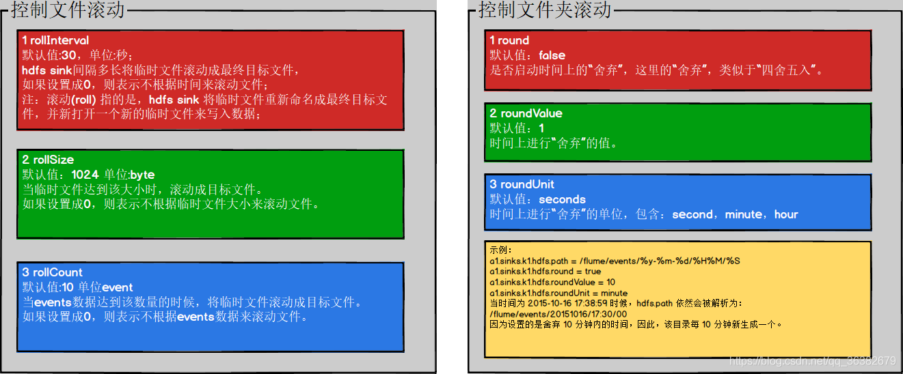

# Flume Sinks

[TOC]

## 1、HDFS Sink

> This sink writes events into the Hadoop Distributed File System (HDFS). It currently supports creating text and sequence files. It supports compression in both file types. The files can be rolled (close current file and create a new one) periodically based on the elapsed time or size of data or number of events. It also buckets/partitions data by attributes like timestamp or machine where the event originated. The HDFS directory path may contain formatting escape sequences that will replaced by the HDFS sink to generate a directory/file name to store the events. Using this sink requires hadoop to be installed so that Flume can use the Hadoop jars to communicate with the HDFS cluster. Note that a version of Hadoop that supports the sync() call is required.

这个 sink 将 events 写入 HDFS。它目前支持创建 text 和 sequence 文件。这两种文件类型都支持压缩。

可以根据运行时间、数据大小或 events 数量周期性地滚动文件(关闭当前文件并创建一个新文件)。

它还根据时间戳或 event 来源的机器等属性对数据进行分桶/分区。

HDFS 目录路径可能包含格式化转义序列，这些转义序列将被 HDFS sink 替换，生成一个用于存储 events 的目录/文件名。

使用这个 sink 需要安装 hadoop，这样 Flume 才能使用 Hadoop jar 与 HDFS 集群通信。

注意，需要一个支持 sync() 调用的 Hadoop 版本。

> The following are the escape sequences supported:

支持的转义序列如下:

Alias   |     Description
---|:---
%{host} |     Substitute value of event header named “host”. Arbitrary header names are supported.
%t      |     Unix time in milliseconds
%a      |     locale’s short weekday name (Mon, Tue, ...)
%A      |     locale’s full weekday name (Monday, Tuesday, ...)
%b      |     locale’s short month name (Jan, Feb, ...)
%B      |     locale’s long month name (January, February, ...)
%c      |     locale’s date and time (Thu Mar 3 23:05:25 2005)
%d      |     day of month (01)
%e      |     day of month without padding (1)
%D      |     date; same as %m/%d/%y
%H      |     hour (00..23)
%I      |     hour (01..12)
%j      |     day of year (001..366)
%k      |     hour ( 0..23)
%m      |     month (01..12)
%n      |     month without padding (1..12)
%M      |     minute (00..59)
%p      |     locale’s equivalent of am or pm
%s      |     seconds since 1970-01-01 00:00:00 UTC
%S      |     second (00..59)
%y      |     last two digits of year (00..99)
%Y      |     year (2010)
%z      |     +hhmm numeric timezone (for example, -0400)
%[localhost]  |  Substitute the hostname of the host where the agent is running【替换agent运行所在的主机的主机名】
%[IP]         |  Substitute the IP address of the host where the agent is running
%[FQDN]       |  Substitute the canonical hostname of the host where the agent is running

> Note: The escape strings %[localhost], %[IP] and %[FQDN] all rely on Java’s ability to obtain the hostname, which may fail in some networking environments.

注意:转义字符串 `%[localhost]`，`%[IP]` 和 `%[FQDN] `都依赖于 Java 获取主机名的能力，这在一些网络环境中可能会失败。

> The file in use will have the name mangled to include ”.tmp” at the end. Once the file is closed, this extension is removed. This allows excluding partially complete files in the directory. Required properties are in bold.

正在使用的文件的名称将被修改为在末尾添加 `.tmp`。一旦文件被关闭，这个扩展名将被删除。这允许排除目录中部分完整的文件。

必需的属性以粗体显示

> Note For all of the time related escape sequences, a header with the key “timestamp” must exist among the headers of the event (unless hdfs.useLocalTimeStamp is set to true). One way to add this automatically is to use the TimestampInterceptor.

对于所有与时间相关的转义序列，带有关键字 `timestamp` 的 header 必须存在于事件的 header 中(除非`hdfs.useLocalTimeStamp`设置为true)。一种方法是使用 TimestampInterceptor 自动添加它。

Property Name      |    Default     | 	Description
---|:---|:---
**channel**	       |       –	    | 
**type**           |       –	    |   The component type name, needs to be `hdfs`【组件类型名称，必须是`hdfs`】
**hdfs.path**	   |       –	    |   HDFS directory path (eg hdfs://namenode/flume/webdata/)【hdfs目录路径】
hdfs.filePrefix	   |   FlumeData	|   Name prefixed to files created by Flume in hdfs directory 【在hdfs目录中，flume创建的文件的前缀名字】
hdfs.fileSuffix	   |       –	    |   Suffix to append to file (eg `.avro` - NOTE: period is not automatically added)【追加到文件的后缀。如`.avro`，点号不是自动添加的】
hdfs.inUsePrefix   |       –	    |   Prefix that is used for temporal files that flume actively writes into【flume正在写入的临时文件的前缀】
hdfs.inUseSuffix   |      .tmp	    |   Suffix that is used for temporal files that flume actively writes into【flume正在写入的临时文件的后缀】
hdfs.emptyInUseSuffix  |	false	|   If false an hdfs.inUseSuffix is used while writing the output. After closing the output hdfs.inUseSuffix is removed from the output file name. If true the hdfs.inUseSuffix parameter is ignored an empty string is used instead.【如果是false，当写输出时，使用hdfs.inUseSuffix。在关闭输出后，hdfs.inUseSuffix从输出文件名中移除。如果是true，shdfs.inUseSuffix被忽略，使用一个空字符串替代。】
hdfs.rollInterval  |	   30	    |   Number of seconds to wait before rolling current file (0 = never roll based on time interval)【在滚动当前文件前，等待的秒数（0=不要基于时间间隔滚动）（滚动就是当达到一定条件，比如本条件，关闭此文件，当仍有数据传来时，新建一个新文件来存储。）】
hdfs.rollSize	   |       1024	    |   File size to trigger roll, in bytes (0: never roll based on file size)【触发滚动的文件大小，字节表示。（0 = 不要基于文件大小滚动）】
hdfs.rollCount	   |        10	    |   Number of events written to file before it rolled (0 = never roll based on number of events)【在滚动前，写入文件的事件数量。（0=不要基于事件数量滚动）】
hdfs.idleTimeout   |        0	    |   Timeout after which inactive files get closed (0 = disable automatic closing of idle files)【关闭非活动文件的超时时间（0=禁用自动关闭空闲文件功能）】
hdfs.batchSize	   |       100	    |   number of events written to file before it is flushed to HDFS【在刷新到hdfs前，写入文件的事件数量（从channel中一次取事件的数量）】
hdfs.codeC	       |         –	    |   Compression codec. one of following : `gzip`, `bzip2`, `lzo`, `lzop`,`snappy`【压缩的编解码器】
hdfs.fileType	   |   SequenceFile	|   File format: currently SequenceFile, DataStream or CompressedStream (1)DataStream will not compress output file and please don’t set codeC (2)CompressedStream requires set hdfs.codeC with an available codeC【文件格式：当前`SequenceFile`、`DataStream`、`CompressedStream`。（1）DataStream 将不压缩输出文件，请不要设置CodeC。（2）CompressedStream 要求使用一个可用的 codeC 设置 hdfs.codeC 】
hdfs.maxOpenFiles  |       5000	    |   Allow only this number of open files. If this number is exceeded, the oldest file is closed.【允许的打开文件的数量。如果超过了限制，最旧的的文件关闭。】
hdfs.minBlockReplicas |	    –	    |   Specify minimum number of replicas per HDFS block. If not specified, it comes from the default Hadoop config in the classpath.【指定每个hdfs块的最小副本数量。如果不指定，使用类路径中的hadoop默认配置】
hdfs.writeFormat   |      Writable	|   Format for sequence file records. One of `Text` or `Writable`. Set to `Text` before creating data files with Flume, otherwise those files cannot be read by either Apache Impala (incubating) or Apache Hive.【序列文件记录的格式。`Text`或`Writable`的一种。在flume创建数据文件前设为`Text`，否则这些文件不能被impala或hive读取】
hdfs.threadsPoolSize  |	    10	    |   Number of threads per HDFS sink for HDFS IO ops (open, write, etc.)【对HDFS IO操作，每个 hdfs sink的线程数量】
hdfs.rollTimerPoolSize|	    1	    |   Number of threads per HDFS sink for scheduling timed file rolling【用于调度定时文件滚动的每个 HDFS sink的线程数】
hdfs.kerberosPrincipal|	     –	    |   Kerberos user principal for accessing secure HDFS
hdfs.kerberosKeytab	  |      –	    |   Kerberos keytab for accessing secure HDFS
hdfs.proxyUser	 	  |             | 
hdfs.round	          |    false	|   Should the timestamp be rounded down (if true, affects all time based escape sequences except %t)【时间戳是否应该被向下取整(如果为true，将影响除%t之外的所有基于转义序列的时间)】
hdfs.roundValue	      |      1	    |   Rounded down to the highest multiple of this (in the unit configured using hdfs.roundUnit), less than current time.【向下取整到该值的最高倍数(在使用`hdfs.roundUnit`配置的单位中)，小于当前时间。】
hdfs.roundUnit	      |    second	|   The unit of the round down value - `second`, `minute` or `hour`.【向下取整值的单位】
hdfs.timeZone	      |  Local Time	|   Name of the timezone that should be used for resolving the directory path, e.g. America/Los_Angeles.【用来解析目录路径的时区的名字】
hdfs.useLocalTimeStamp|	     false	|   Use the local time (instead of the timestamp from the event header) while replacing the escape sequences.【当替换转移序列时，使用本地时间（而不是来事件header的时间戳）】
hdfs.closeTries	      |      0	    |   Number of times the sink must try renaming a file, after initiating a close attempt. If set to 1, this sink will not re-try a failed rename (due to, for example, NameNode or DataNode failure), and may leave the file in an open state with a .tmp extension. If set to 0, the sink will try to rename the file until the file is eventually renamed (there is no limit on the number of times it would try). The file may still remain open if the close call fails but the data will be intact and in this case, the file will be closed only after a Flume restart.【在发起一个关闭尝试后，sink必须尝试重命名一个文件的次数。如果设为1，这个sink不会重试一个失败的重命名（如NameNode or DataNode故障），可能会让这个文件保持为打开状态，后缀是`.tmp`。如果设为0，sink会尝试重命名文件，直到在文件被最终重命名（没有重试次数的限制）。如果调用关闭失败，文件会仍保持打开状态。但数据仍是原封不动的，文件会在flume重启后关闭。】
hdfs.retryInterval	  |      180	|   Time in seconds between consecutive attempts to close a file. Each close call costs multiple RPC round-trips to the Namenode, so setting this too low can cause a lot of load on the name node. If set to 0 or less, the sink will not attempt to close the file if the first attempt fails, and may leave the file open or with a ”.tmp” extension.【连续尝试关闭文件的时间间隔(秒)。每次关闭调用都要花费到Namenode的多次RPC往返，因此设置得太低可能会导致name node节点上的大量负载。如果设置为0或更小，sink在第一次尝试失败时不会尝试关闭文件，并且可能会让文件保持打开状态或使用`.tmp`的扩展。】
serializer	          |    `TEXT`	|    Other possible options include `avro_event` or the fully-qualified class name of an implementation of the `EventSerializer.Builder`interface.【其他可能的选项包括`avro_event`或`EventSerializer.Builder`接口实现类的完全限定类名】
serializer.*	      |             | 	 

> Deprecated Properties

Property Name      |    Default     | 	Description
---|:---|:---
hdfs.callTimeout   |     30000      |   Number of milliseconds allowed for HDFS operations, such as open, write, flush, close. This number should be increased if many HDFS timeout operations are occurring. 

> Example for agent named a1:

	a1.channels = c1
	a1.sinks = k1
	a1.sinks.k1.type = hdfs
	a1.sinks.k1.channel = c1
	a1.sinks.k1.hdfs.path = /flume/events/%y-%m-%d/%H%M/%S
	a1.sinks.k1.hdfs.filePrefix = events-
	a1.sinks.k1.hdfs.round = true
	a1.sinks.k1.hdfs.roundValue = 10
	a1.sinks.k1.hdfs.roundUnit = minute

> The above configuration will round down the timestamp to the last 10th minute. For example, an event with timestamp 11:54:34 AM, June 12, 2012 will cause the hdfs path to become /flume/events/2012-06-12/1150/00.

上面的配置将把时间戳向下取整到最后10分钟。例如，一个时间戳为 `11:54:34 AM, June 12, 2012`的事件将 hdfs 路径变成 `/flume/events/2012-06-12/1150/00`。

---------------------------------------------------------------------

参考理解：

[https://blog.csdn.net/weixin_42102379/article/details/88942934](https://blog.csdn.net/weixin_42102379/article/details/88942934)



----------------------------------------------------------------------

## 2、Hive Sink

> This sink streams events containing delimited text or JSON data directly into a Hive table or partition. Events are written using Hive transactions. As soon as a set of events are committed to Hive, they become immediately visible to Hive queries. Partitions to which flume will stream to can either be pre-created or, optionally, Flume can create them if they are missing. Fields from incoming event data are mapped to corresponding columns in the Hive table.

该 sink 将包含分隔文本或 JSON 数据的 events 直接流到 Hive 表或分区中。

Events 是使用 Hive 事务写的。一旦一组 events 提交给 Hive，它们就会立即对 Hive 查询可见。

flume 将流到的分区可以预先创建，或者，如果缺少分区，flume 也可以创建分区。

传入 event 数据的字段映射到 Hive 表中相应的列。

Property Name      |    Default     | 	Description
---|:---|:---
**channel**	       |       –	    |
**type**	       |       –	    |   The component type name, needs to be `hive`【组件类型名称，必须是`hive`】
**hive.metastore** |       –	    |   Hive metastore URI (eg thrift://a.b.com:9083 )
**hive.database**  |       –	    |   Hive database name
**hive.table**	   |       –	    |   Hive table name
hive.partition	   |       –	    |   Comma separate list of partition values identifying the partition to write to. May contain escape sequences. E.g: If the table is partitioned by (continent: string, country :string, time : string) then ‘Asia,India,2014-02-26-01-21’ will indicate continent=Asia,country=India,time=2014-02-26-01-21【逗号分隔的分区值的列表，分区值表示要写入的分区。可能包含转移序列，如：如果表被(continent: string, country :string, time : string)分区，那么`Asia,India,2014-02-26-01-21` 表示`continent=Asia,country=India,time=2014-02-26-01-21`】
hive.txnsPerBatchAsk|	 100	    |   Hive grants a batch of transactions instead of single transactions to streaming clients like Flume. This setting configures the number of desired transactions per Transaction Batch. Data from all transactions in a single batch end up in a single file. Flume will write a maximum of batchSize events in each transaction in the batch. This setting in conjunction with batchSize provides control over the size of each file. Note that eventually Hive will transparently compact these files into larger files.【Hive将一批事务而不是单个事务授权像Flume这样的流客户端。此设置配置每个事务批次中所需的事务数量。来自单个批次中所有事务的数据最终保存在单个文件中。Flume将在批次中的每个事务中写入最大数量的batchSize事件。这个设置与batchSize一起提供了对每个文件大小的控制。请注意，最终Hive会透明地将这些文件压缩成更大的文件。】
heartBeatInterval |	      240	   |    (In seconds) Interval between consecutive heartbeats sent to Hive to keep unused transactions from expiring. Set this value to 0 to disable heartbeats.【发送到hive的两次连续心跳间的间隔（秒），来防止未使用的事务过期。将该值设置为0表示禁用心跳。】
autoCreatePartitions|	 true	   |    Flume will automatically create the necessary Hive partitions to stream to【flume将自动创建必要的hive分区，使数据流入。】
batchSize	      |      15000	   |    Max number of events written to Hive in a single Hive transaction【在一次hive事务中，写入hive事件的最大数量】
maxOpenConnections|       500	   |   Allow only this number of open connections. If this number is exceeded, the least recently used connection is closed.【允许打开的连接的最大数据量。如果超过这个限制，关闭最近最少使用的连接。】
callTimeout	      |      10000	   |   (In milliseconds) Timeout for Hive & HDFS I/O operations, such as openTxn, write, commit, abort.【对Hive & HDFS I/O的IO操作的超时时长】
**serializer**    |	 	           |   Serializer is responsible for parsing out field from the event and mapping them to columns in the hive table. Choice of serializer depends upon the format of the data in the event. Supported serializers: DELIMITED and JSON【Serializer负责解析出event中的字段，并将其映射到hive表中的列。序列化程序的选择取决于event中数据的格式。支持的序列化器:`DELIMITED`和`JSON`】
roundUnit	      |      minute	   |   The unit of the round down value - `second`, `minute` or `hour`.【向下取整值的单位】
roundValue	      |         1	   |   Rounded down to the highest multiple of this (in the unit configured using hive.roundUnit), less than current time【向下取整到该值的最高倍数(在使用hdfs.roundUnit配置的单位中)，小于当前时间。】
timeZone	      |    Local Time  |   Name of the timezone that should be used for resolving the escape sequences in partition, e.g. America/Los_Angeles.【用来解析目录路径的时区的名字】
useLocalTimeStamp |	     false	   |   Use the local time (instead of the timestamp from the event header) while replacing the escape sequences.【当替换转移序列时，使用本地时间（而不是来事件header的时间戳）】

> Following serializers are provided for Hive sink:

Hive sink 提供了如下的序列器：

> **JSON**: Handles UTF8 encoded Json (strict syntax) events and requires no configration. Object names in the JSON are mapped directly to columns with the same name in the Hive table. Internally uses org.apache.hive.hcatalog.data.JsonSerDe but is independent of the Serde of the Hive table. This serializer requires HCatalog to be installed.

**JSON**: 处理 UTF8 编码的Json(严格语法)events，不需要配置。JSON 中的对象名称直接映射到 Hive 表中同名的列。在内部使用`org.apache.hive.hcatalog.data.JsonSerDe`。但独立于 Hive 表的 Serde。这个序列化器需要安装 HCatalog。

> **DELIMITED**: Handles simple delimited textual events. Internally uses LazySimpleSerde but is independent of the Serde of the Hive table.

**DELIMITED**: 处理简单的 DELIMITED 文本 events。内部使用 LazySimpleSerde，但独立于 Hive 表的 Serde。

Property Name              |    Default     | 	Description
---|:---|:---
serializer.delimiter	   |       ,	    |   (Type: string) The field delimiter in the incoming data. To use special characters, surround them with double quotes like “\t”【（类型：字符串）在输入数据中字段的分隔符。为了使用特殊字符，使用双引号包围它，如“\t”】
**serializer.fieldnames**  |       –	    |   The mapping from input fields to columns in hive table. Specified as a comma separated list (no spaces) of hive table columns names, identifying the input fields in order of their occurrence. To skip fields leave the column name unspecified. Eg. ‘time,,ip,message’ indicates the 1st, 3rd and 4th fields in input map to time, ip and message columns in the hive table.【从输入字段映射到hive表中的列。hive表中各列的名称的列表，以逗号分隔(不支持空格)，按列的出现顺序标识输入字段。若要跳过字段，请保留未指定的列名。如‘time,,ip,message’输入中的第1，第3和第4个字段到hive表中的time, ip和message列的映射。】
serializer.serdeSeparator  |     Ctrl-A	    |    (Type: character) Customizes the separator used by underlying serde. There can be a gain in efficiency if the fields in serializer.fieldnames are in same order as table columns, the serializer.delimiter is same as the serializer.serdeSeparator and number of fields in serializer.fieldnames is less than or equal to number of table columns, as the fields in incoming event body do not need to be reordered to match order of table columns. Use single quotes for special characters like ‘\t’. Ensure input fields do not contain this character. NOTE: If serializer.delimiter is a single character, preferably set this to the same character【（类型：字符）自定义底层serde使用的分隔符。如果`serializer.fieldnames`中的字段与表中的列的顺序相同，`serializer.delimiter`和`serializer.serdeSeparator`相同，`serializer.fieldnames`中的字段数量小于或等于表的列的数量，可以提高效率。因为传入事件主体中的字段不需要重新排序以匹配表列的顺序。对于特殊字符，如‘\t’，请使用单引号。确保输入字段不包含此字符。注意:如果`serializer.delimiter`是单个字符，最好将其设置为相同的字符】

> The following are the escape sequences supported:

支持下列转义字符：

Alias   |     Description
---|:---
%{host} |	  Substitute value of event header named “host”. Arbitrary header names are supported.
%t	    |     Unix time in milliseconds
%a	    |     locale’s short weekday name (Mon, Tue, ...)
%A	    |     locale’s full weekday name (Monday, Tuesday, ...)
%b	    |     locale’s short month name (Jan, Feb, ...)
%B	    |     locale’s long month name (January, February, ...)
%c	    |     locale’s date and time (Thu Mar 3 23:05:25 2005)
%d	    |     day of month (01)
%D	    |     date; same as %m/%d/%y
%H	    |     hour (00..23)
%I	    |     hour (01..12)
%j	    |     day of year (001..366)
%k	    |     hour ( 0..23)
%m	    |     month (01..12)
%M	    |     minute (00..59)
%p	    |     locale’s equivalent of am or pm
%s	    |     seconds since 1970-01-01 00:00:00 UTC
%S	    |     second (00..59)
%y	    |     last two digits of year (00..99)
%Y	    |     year (2010)
%z	    |     +hhmm numeric timezone (for example, -0400)

> Note For all of the time related escape sequences, a header with the key “timestamp” must exist among the headers of the event (unless useLocalTimeStamp is set to true). One way to add this automatically is to use the TimestampInterceptor.

对于所有与时间相关的转义序列，带有关键字 timestamp 的 header 必须存在于事件的 header 中(除非hdfs.useLocalTimeStamp设置为true)。一种方法是使用 TimestampInterceptor 自动添加它。

> Example Hive table :

```sql
create table weblogs ( id int , msg string )
    partitioned by (continent string, country string, time string)
    clustered by (id) into 5 buckets
    stored as orc;
```

> Example for agent named a1:

	a1.channels = c1
	a1.channels.c1.type = memory
	a1.sinks = k1
	a1.sinks.k1.type = hive
	a1.sinks.k1.channel = c1
	a1.sinks.k1.hive.metastore = thrift://127.0.0.1:9083
	a1.sinks.k1.hive.database = logsdb
	a1.sinks.k1.hive.table = weblogs
	a1.sinks.k1.hive.partition = asia,%{country},%y-%m-%d-%H-%M
	a1.sinks.k1.useLocalTimeStamp = false
	a1.sinks.k1.round = true
	a1.sinks.k1.roundValue = 10
	a1.sinks.k1.roundUnit = minute
	a1.sinks.k1.serializer = DELIMITED
	a1.sinks.k1.serializer.delimiter = "\t"
	a1.sinks.k1.serializer.serdeSeparator = '\t'
	a1.sinks.k1.serializer.fieldnames =id,,msg

> The above configuration will round down the timestamp to the last 10th minute. For example, an event with timestamp header set to 11:54:34 AM, June 12, 2012 and ‘country’ header set to ‘india’ will evaluate to the partition (continent=’asia’,country=’india’,time=‘2012-06-12-11-50’). The serializer is configured to accept tab separated input containing three fields and to skip the second field.

上面的配置将把时间戳向下取整到最后10分钟。例如，一个 timestamp header 为 11:54:34 AM, June 12, 2012，‘country’ header 为 ‘india’ 的 event 将计算分区`(continent=’asia’,country=’india’,time=‘2012-06-12-11-50’)`。序列化器配置为包含 3 个字段的接受 tab 分隔的输入，跳过了第二个字段。

## 3、Logger Sink

> Logs event at INFO level. Typically useful for testing/debugging purpose. Required properties are in bold. This sink is the only exception which doesn’t require the extra configuration explained in the Logging raw data section.

日志输出 event，在 INFO 级别。通常用于测试/调试目的。

必需的属性以粗体显示。

这个 sink 是唯一的例外，它不需要日志记录原始数据部分中解释的额外配置。

Property Name      |    Default     | 	Description
---|:---|:---
**channel**	       |       –	    |
**type**	       |       –	    |   The component type name, needs to be `logger`【组件类型名称，必须是`logger`】
maxBytesToLog	   |       16	    |   Maximum number of bytes of the Event body to log【日志输出的事件主体的最大的字节数量】

> Example for agent named a1:

	a1.channels = c1
	a1.sinks = k1
	a1.sinks.k1.type = logger
	a1.sinks.k1.channel = c1

## 4、Avro Sink

> This sink forms one half of Flume’s tiered collection support. Flume events sent to this sink are turned into Avro events and sent to the configured hostname / port pair. The events are taken from the configured Channel in batches of the configured batch size. Required properties are in bold.

发送到该 sink 的 Flume events 被转换为 Avro events，并发送到配置好的 hostname/port 对。

events 按配置的批次大小分批从配置的 Channel 获取。

必需的属性以粗体显示。

Property Name    |   Default   | 	Description
---|:---|:---
**channel**	     |      –	   |
**type**	     |      –	   |    The component type name, needs to be `avro`.【组件类型名称，必须是`avro`】
**hostname**	 |      –	   |    The hostname or IP address to bind to.【绑定的主机名或ip地址】
**port**	     |      –	   |    The port # to listen on.【监听的端口】
batch-size	     |     100	   |    number of event to batch together for send.【一个批次发送的事件数量】
connect-timeout	 |    20000	   |    Amount of time (ms) to allow for the first (handshake) request.【允许第一个(握手)请求的时间(ms)。】
request-timeout	 |    20000	   |    Amount of time (ms) to allow for requests after the first.【在第一个(握手)请求之后，允许的请求的时间(ms)。】
reset-connection-interval|none |	Amount of time (s) before the connection to the next hop is reset. This will force the Avro Sink to reconnect to the next hop. This will allow the sink to connect to hosts behind a hardware load-balancer when news hosts are added without having to restart the agent.【连接到下一跳之前被重置的时间。这将迫使Avro Sink重新连接到下一跳。这将允许sink在添加新主机时连接到硬件负载均衡器后的主机，而不必重新启动代理】
compression-type |	   none	   |    This can be “none” or “deflate”. The compression-type must match the compression-type of matching AvroSource【可以是“none或“deflate”。压缩类型必须匹配与之匹配的AvroSource的压缩类型】
compression-level|	     6	   |    The level of compression to compress event. 0 = no compression and 1-9 is compression. The higher the number the more compression【压缩事件的压缩等级。0表示不压缩。1-9数字越高，压缩越多。】
ssl	             |     false   |    Set to true to enable SSL for this AvroSink. When configuring SSL, you can optionally set a “truststore”, “truststore-password”, “truststore-type”, and specify whether to “trust-all-certs”.【为true时，为这个AvroSink启用ssl。当配置了ssl，可以可选地也设置一个“truststore”、“truststore-password”、“truststore-type”，并指定是否“trust-all-certs”。】
trust-all-certs	 |     false   |    If this is set to true, SSL server certificates for remote servers (Avro Sources) will not be checked. This should NOT be used in production because it makes it easier for an attacker to execute a man-in-the-middle attack and “listen in” on the encrypted connection.【如果这个设为true，对远程服务器(Avro Sources)，将不会检查其ssl服务证书。这不应该在生成中使用。】
truststore	     |       –	   |     The path to a custom Java truststore file. Flume uses the certificate authority information in this file to determine whether the remote Avro Source’s SSL authentication credentials should be trusted. If not specified, then the global keystore will be used. If the global keystore not specified either, then the default Java JSSE certificate authority files (typically “jssecacerts” or “cacerts” in the Oracle JRE) will be used.【自定义Java truststore文件的路径。Flume使用此文件中的证书授权信息来确定远程Avro Source’s的SSL身份验证凭据是否应该受信任。如果未指定，则将使用全局keystore。如果没有指定全局keystore，则将使用默认的Java JSSE证书授权文件(通常是Oracle JRE中的“jssecacerts”或“cacerts”)。】
truststore-password|	 –	   |     The password for the truststore. If not specified, then the global keystore password will be used (if defined).
truststore-type	 |      JKS	   |     The type of the Java truststore. This can be “JKS” or other supported Java truststore type. If not specified, then the global keystore type will be used (if defined, otherwise the defautl is JKS).
exclude-protocols|	   SSLv3   |      Space-separated list of SSL/TLS protocols to exclude. SSLv3 will always be excluded in addition to the protocols specified.
maxIoWorkers	 | 2 * the number of available processors in the machine  |  The maximum number of I/O worker threads. This is configured on the NettyAvroRpcClient NioClientSocketChannelFactory.【I/O worker线程的最大数量。在NettyAvroRpcClient NioClientSocketChannelFactory上配置。】

> Example for agent named a1:

	a1.channels = c1
	a1.sinks = k1
	a1.sinks.k1.type = avro
	a1.sinks.k1.channel = c1
	a1.sinks.k1.hostname = 10.10.10.10
	a1.sinks.k1.port = 4545

## 5、Thrift Sink

> This sink forms one half of Flume’s tiered collection support. Flume events sent to this sink are turned into Thrift events and sent to the configured hostname / port pair. The events are taken from the configured Channel in batches of the configured batch size.

发送到这个 sink 的 Flume events 被转换成 Thrift events，并发送到配置好的 hostname/port 对。events 按配置的批次大小分批从配置的 Channel 获取。

> Thrift sink can be configured to start in secure mode by enabling kerberos authentication. To communicate with a Thrift source started in secure mode, the Thrift sink should also operate in secure mode. client-principal and client-keytab are the properties used by the Thrift sink to authenticate to the kerberos KDC. The server-principal represents the principal of the Thrift source this sink is configured to connect to in secure mode. Required properties are in bold.

通过启用 kerberos 身份验证，可以将 Thrift sink 配置为以安全模式启动。

要与在安全模式下启动的 Thrift source 通信，Thrift sink 也应该在安全模式下运行。

client-principal 和 client-keytab 是 Thrift sink 用于对 kerberos KDC 进行身份验证的属性。server-principal 表示此接 sink 被配置为以安全模式连接到的 Thrift source 的主体。

必需的属性以粗体显示。

Property Name    |   Default   | 	Description
---|:---|:---
**channel** 	 |      –	   |
**type** 	     |      –	   |    The component type name, needs to be `thrift`.【组件类型名称，必须是`thrift`】
**hostname** 	 |      –	   |    The hostname or IP address to bind to.【绑定的主机名或ip地址】
**port** 	     |      –	   |    The port # to listen on.【监听的端口】
batch-size	     |     100	   |    number of event to batch together for send.【一个批次发送的事件数量】
connect-timeout	 |    20000	   |    Amount of time (ms) to allow for the first (handshake) request.【允许第一个(握手)请求的时间(ms)。】
request-timeout	 |    20000	   |    Amount of time (ms) to allow for requests after the first.在第一个(握手)请求之后，允许的请求的时间(ms)。】
connection-reset-interval|none |	Amount of time (s) before the connection to the next hop is reset. This will force the Thrift Sink to reconnect to the next hop. This will allow the sink to connect to hosts behind a hardware load-balancer when news hosts are added without having to restart the agent.【连接到下一跳之前被重置的时间。这将迫使Thrift Sink重新连接到下一跳。这将允许sink在添加新主机时连接到硬件负载均衡器后的主机，而不必重新启动代理】
ssl	             |    false	   |    Set to true to enable SSL for this ThriftSink. When configuring SSL, you can optionally set a “truststore”, “truststore-password” and “truststore-type”【为true时，为这个ThriftSink启用ssl。当配置了ssl，可以可选地也设置一个“truststore”、“truststore-password”、“truststore-type”。】
truststore	     |      –	   |    The path to a custom Java truststore file. Flume uses the certificate authority information in this file to determine whether the remote Thrift Source’s SSL authentication credentials should be trusted. If not specified, then the global keystore will be used. If the global keystore not specified either, then the default Java JSSE certificate authority files (typically “jssecacerts” or “cacerts” in the Oracle JRE) will be used.【自定义Java truststore文件的路径。Flume使用此文件中的证书授权信息来确定远程Thrift Source’s的SSL身份验证凭据是否应该受信任。如果未指定，则将使用全局keystore。如果没有指定全局keystore，则将使用默认的Java JSSE证书授权文件(通常是Oracle JRE中的“jssecacerts”或“cacerts”)。】
truststore-password|	–	   |     The password for the truststore. If not specified, then the global keystore password will be used (if defined).
truststore-type	 |     JKS	   |     The type of the Java truststore. This can be “JKS” or other supported Java truststore type. If not specified, then the global keystore type will be used (if defined, otherwise the defautl is JKS).
exclude-protocols|	  SSLv3	   |      Space-separated list of SSL/TLS protocols to exclude
kerberos	     |    false	   |      Set to true to enable kerberos authentication. In kerberos mode, client-principal, client-keytab and server-principal are required for successful authentication and communication to a kerberos enabled Thrift Source.
client-principal |	   —-	   |      The kerberos principal used by the Thrift Sink to authenticate to the kerberos KDC.
client-keytab	 |     —-	   |       The keytab location used by the Thrift Sink in combination with the client-principal to authenticate to the kerberos KDC.
server-principal |     –	   |       The kerberos principal of the Thrift Source to which the Thrift Sink is configured to connect to.

> Example for agent named a1:

	a1.channels = c1
	a1.sinks = k1
	a1.sinks.k1.type = thrift
	a1.sinks.k1.channel = c1
	a1.sinks.k1.hostname = 10.10.10.10
	a1.sinks.k1.port = 4545

## 6、IRC Sink

> The IRC sink takes messages from attached channel and relays those to configured IRC destinations. Required properties are in bold.

IRC sink 从附加的 channel 接收消息，并将这些消息转发到配置的 IRC 目的地。

必需的属性以粗体显示。

Property Name    |   Default   | 	Description
---|:---|:---
**channel**	     |      –	   |
**type**	     |      –	   |    The component type name, needs to be `irc`【组件类型名称，必须是`irc`】
**hostname**	 |      –	   |    The hostname or IP address to connect to【连接的主机名或ip地址】
port	         |     6667	   |    The port number of remote host to connect【连接的远程主机的端口号】
**nick**	     |      –	   |    Nick name
user	         |      –	   |    User name
password	     |      –	   |    User password
**chan**	     |      –	   |    channel
name	 	     |      –	   |
splitlines	     |      –	   |    (boolean)
splitchars	     |      n	   |    line separator (if you were to enter the default value into the config file, then you would need to escape the backslash, like this: “\n”)【行分隔符（如果要在配置文件中输入默认值，则需要转义反斜杠，如：“\n”）】

> Example for agent named a1:

	a1.channels = c1
	a1.sinks = k1
	a1.sinks.k1.type = irc
	a1.sinks.k1.channel = c1
	a1.sinks.k1.hostname = irc.yourdomain.com
	a1.sinks.k1.nick = flume
	a1.sinks.k1.chan = #flume

## 7、File Roll Sink

> Stores events on the local filesystem. Required properties are in bold.

将 events 存储在本地文件系统。

必需的属性以粗体显示。

Property Name    |   Default   | 	Description
---|:---|:---
**channel**	     |      –	   |
**type**	     |      –	   |    The component type name, needs to be `file_roll`.【组件类型名称，必须是`file_roll`】
**sink.directory**|	    –	   |    The directory where files will be stored【文件存储的目录】
sink.pathManager |    DEFAULT  | 	The PathManager implementation to use.【使用的PathManager实现】
sink.pathManager.extension|	–  |    The file extension if the default PathManager is used.【如果使用了默认的PathManager，文件的扩展】
sink.pathManager.prefix|–	   |    A character string to add to the beginning of the file name if the default PathManager is used【如果使用了默认的PathManager，一个字符字符串添加到文件名字的开始。】
sink.rollInterval|	    30	   |    Roll the file every 30 seconds. Specifying 0 will disable rolling and cause all events to be written to a single file.【每30秒滚动一次文件。指定0将禁用滚动，并导致所有事件被写入单个文件。】
sink.serializer  |    `TEXT`   |    Other possible options include `avro_event` or the FQCN of an implementation of `EventSerializer.Builder` interface.【其他可能的选项包括`avro_event`，或`EventSerializer.Builder`接口的实现类的完全限定类名】
sink.batchSize	 |     100	   | 

> Example for agent named a1:

	a1.channels = c1
	a1.sinks = k1
	a1.sinks.k1.type = file_roll
	a1.sinks.k1.channel = c1
	a1.sinks.k1.sink.directory = /var/log/flume


## 8、Null Sink

> Discards all events it receives from the channel. Required properties are in bold.

丢弃从 channel 接收的所有 events。必需的属性以粗体显示。

Property Name    |   Default   | 	Description
---|:---|:---
**channel**	     |      –	   |
**type**	     |      –	   |    The component type name, needs to be `null`.【组件类型名称，必须是`null`】
batchSize	     |     100	   |

> Example for agent named a1:

	a1.channels = c1
	a1.sinks = k1
	a1.sinks.k1.type = null
	a1.sinks.k1.channel = c1

## 9、HBaseSinks

### 9.1、HBaseSink

> This sink writes data to HBase. The Hbase configuration is picked up from the first hbase-site.xml encountered in the classpath. A class implementing HbaseEventSerializer which is specified by the configuration is used to convert the events into HBase puts and/or increments. These puts and increments are then written to HBase. This sink provides the same consistency guarantees as HBase, which is currently row-wise atomicity. In the event of Hbase failing to write certain events, the sink will replay all events in that transaction.

该 sink 向 HBase 写入数据。Hbase 配置是从类路径中遇到的第一个 `hbase-site.xml` 中获取的。

一个实现 `HbaseEventSerializer` 的类，由配置指定，用于将 events 转换为 HBase 的 put 和或 increment。然后这些 put 和 increment 写入 HBase。

这个 sink 提供了与 HBase 相同的一致性保证，目前是行原子性。当 Hbase 写某些 events 失败时，sink将重播该事务中的所有 events。

> The HBaseSink supports writing data to secure HBase. To write to secure HBase, the user the agent is running as must have write permissions to the table the sink is configured to write to. The principal and keytab to use to authenticate against the KDC can be specified in the configuration. The hbase-site.xml in the Flume agent’s classpath must have authentication set to kerberos (For details on how to do this, please refer to HBase documentation).

HBaseSink 支持向安全的 HBase 写入数据。

要写到安全的 HBase，运行 agent 的用户必须对 sink 要写的表有写权限。

可以在配置中指定用于针对 KDC 进行身份验证的 principal 和 keytab。Flume agent 的类路径中的 `hbase-site.xml` 必须将身份验证设置为 kerberos(关于如何做到这一点的详细信息，请参考HBase文档)。

> For convenience, two serializers are provided with Flume. The SimpleHbaseEventSerializer (org.apache.flume.sink.hbase.SimpleHbaseEventSerializer) writes the event body as-is to HBase, and optionally increments a column in Hbase. This is primarily an example implementation. The RegexHbaseEventSerializer (org.apache.flume.sink.hbase.RegexHbaseEventSerializer) breaks the event body based on the given regex and writes each part into different columns.

为了方便，Flume 提供了两个序列化器。

`SimpleHbaseEventSerializer` (`org.apache.flume.sink.hbase.SimpleHbaseEventSerializer`)将 event body 按原貌写入 HBase，并可选择地在 HBase 中增加一个列。这主要是一个示例实现。

`RegexHbaseEventSerializer` 基于给定的正则分解 event body ，并将每个部分写入不同的列中。

> The type is the FQCN: org.apache.flume.sink.hbase.HBaseSink.

类型为 FQCN: `org.apache.flume.sink.hbase.HBaseSink`。

> Required properties are in bold.

必需的属性以粗体显示。

Property Name    |   Default   | 	Description
---|:---|:---
**channel**	     |      –	   |	 
**type**	     |      –	   |    The component type name, needs to be `hbase`【组件类型名称，必须是`hbase`】
**table**	     |      –	   |    The name of the table in Hbase to write to.【要写入hbase中的表名】
**columnFamily** |   	–	   |    The column family in Hbase to write to.【要写入hbase中的列族名】
zookeeperQuorum	 |      –	   |    The quorum spec. This is the value for the property `hbase.zookeeper.quorum` in `hbase-site.xml`
znodeParent	     |    /hbase   |    The base path for the znode for the -ROOT- region. Value of `zookeeper.znode.parent` in `hbase-site.xml`
batchSize	     |     100	   |    Number of events to be written per txn.【每次事务中，写入的事件数量】
coalesceIncrements|	  false	   |    Should the sink coalesce multiple increments to a cell per batch. This might give better performance if there are multiple increments to a limited number of cells.【sink是否在每个批次中对一个单元合并多个增量。如果对有限的单元格存在多个增量，这可能会带来更好的性能。】
serializer	| org.apache.flume.sink.hbase.SimpleHbaseEventSerializer  |	Default increment column = “iCol”, payload column = “pCol”.
serializer.*	 |      –	   |    Properties to be passed to the serializer.
kerberosPrincipal|	    –	   |    Kerberos user principal for accessing secure HBase
kerberosKeytab	 |      –	   |    Kerberos keytab for accessing secure HBase

> Example for agent named a1:

	a1.channels = c1
	a1.sinks = k1
	a1.sinks.k1.type = hbase
	a1.sinks.k1.table = foo_table
	a1.sinks.k1.columnFamily = bar_cf
	a1.sinks.k1.serializer = org.apache.flume.sink.hbase.RegexHbaseEventSerializer
	a1.sinks.k1.channel = c1

### 9.2、HBase2Sink

> HBase2Sink is the equivalent of HBaseSink for HBase version 2. The provided functionality and the configuration parameters are the same as in case of HBaseSink (except the hbase2 tag in the sink type and the package/class names).

HBase2Sink 相当于 HBase version 2 中的 HBaseSink。

所提供的功能和配置参数与 HBaseSink 的情况相同(除了 sink type 和包/类名中的 hbase2 标签)。

> The type is the FQCN: org.apache.flume.sink.hbase2.HBase2Sink.

> Required properties are in bold.

Property Name    |   Default   | 	Description
---|:---|:---
**channel**	     |      –	   |		 
**type**	     |      –	   |    The component type name, needs to be `hbase2`【组件类型名称，必须是`hbase2`】
**table**	     |      –	   |    The name of the table in Hbase to write to.【要写入hbase中的表名】
**columnFamily** |   	–	   |    The column family in Hbase to write to.【要写入hbase中的列族名】
zookeeperQuorum	 |      –	   |    The quorum spec. This is the value for the property `hbase.zookeeper.quorum` in `hbase-site.xml`
znodeParent	     |   /hbase	   |    The base path for the znode for the -ROOT- region. Value of `zookeeper.znode.parent` in `hbase-site.xml`
batchSize	     |     100	   |    Number of events to be written per txn.
coalesceIncrements|	  false	   |    Should the sink coalesce multiple increments to a cell per batch. This might give better performance if there are multiple increments to a limited number of cells.
serializer  |org.apache.flume.sink.hbase2.SimpleHBase2EventSerializer  |Default increment column = “iCol”, payload column = “pCol”.
serializer.*	 |      –	   |    Properties to be passed to the serializer.
kerberosPrincipal|	    –	   |    Kerberos user principal for accessing secure HBase
kerberosKeytab	 |      –	   |Kerberos keytab for accessing secure HBase

> Example for agent named a1:

	a1.channels = c1
	a1.sinks = k1
	a1.sinks.k1.type = hbase2
	a1.sinks.k1.table = foo_table
	a1.sinks.k1.columnFamily = bar_cf
	a1.sinks.k1.serializer = org.apache.flume.sink.hbase2.RegexHBase2EventSerializer
	a1.sinks.k1.channel = c1

### 9.3、AsyncHBaseSink

> This sink writes data to HBase using an asynchronous model. A class implementing AsyncHbaseEventSerializer which is specified by the configuration is used to convert the events into HBase puts and/or increments. These puts and increments are then written to HBase. This sink uses the Asynchbase API to write to HBase. This sink provides the same consistency guarantees as HBase, which is currently row-wise atomicity. In the event of Hbase failing to write certain events, the sink will replay all events in that transaction. AsyncHBaseSink can only be used with HBase 1.x. The async client library used by AsyncHBaseSink is not available for HBase 2. The type is the FQCN: org.apache.flume.sink.hbase.AsyncHBaseSink. Required properties are in bold.

该 sink 使用异步模型向 HBase 写入数据。

一个在配置中指定的 AsyncHbaseEventSerializer 的实现类，用于将 events 转换为 HBase 的 put 和或 increment。然后这些 put 和 increment 被写入 HBase。

这个 sink 使用 Asynchbase API 写 HBase。这个 sink 提供了与 HBase 相同的一致性保证，目前是行原子性。

当 Hbase 写某些 events 失败时，sink 将重播该事务中的所有 events。

AsyncHBaseSink 只能与 HBase 1.x 一起使用。AsyncHBaseSink 使用的异步客户端库不支持 HBase 2。

类型是 FQCN: org.apache.flume.sink.hbase.AsyncHBaseSink。

必需的属性以粗体显示。

Property Name    |   Default   | 	Description
---|:---|:---
**channel**	     |      –	   |	 
**type**	     |      –	   |    The component type name, needs to be `asynchbase`【组件类型名称，必须是`asynchbase`】
**table**	     |      –	   |    The name of the table in Hbase to write to.【要写入hbase中的表名】
zookeeperQuorum	 |      –	   |    The quorum spec. This is the value for the property `hbase.zookeeper.quorum` in `hbase-site.xml`
znodeParent	     |    /hbase   |    The base path for the znode for the -ROOT- region. Value of `zookeeper.znode.parent` in `hbase-site.xml`
columnFamily	 |      –	   |    The column family in Hbase to write to.
batchSize	     |     100	   |    Number of events to be written per txn.
coalesceIncrements|   false	   |    Should the sink coalesce multiple increments to a cell per batch. This might give better performance if there are multiple increments to a limited number of cells.
timeout	         |    60000	   |    The length of time (in milliseconds) the sink waits for acks from hbase for all events in a transaction.【sink在一个事务中等待hbase ack的时间长度(以毫秒为单位)。】
serializer	 | org.apache.flume.sink.hbase.SimpleAsyncHbaseEventSerializer	  |
serializer.*     |	    –	   |    Properties to be passed to the serializer.
async.*	         |      –	   |    Properties to be passed to asyncHbase library. These properties have precedence over the old zookeeperQuorum and znodeParent values. You can find the list of the available properties at the documentation page of AsyncHBase.【要传递给asyncHbase库的属性。这些属性优先于旧的zookeeperQuorum和znodepparent值。可以在AsyncHBase的文档页上找到可用属性的列表。】

> Note that this sink takes the Zookeeper Quorum and parent znode information in the configuration. Zookeeper Quorum and parent node configuration may be specified in the flume configuration file. Alternatively, these configuration values are taken from the first hbase-site.xml file in the classpath.

注意，这个 sink 接受配置中的 Zookeeper Quorum 和 parent znode 信息。Zookeeper Quorum 和 parent znode 配置可以在 flume 配置文件中指定。或者，这些配置值取自类路径中的第一个 `hbase-site.xml` 文件。

> If these are not provided in the configuration, then the sink will read this information from the first hbase-site.xml file in the classpath.

如果配置中没有提供这些信息，那么 sink 将从类路径中的第一个 `hbase-site.xml` 文件中读取这些信息。

> Example for agent named a1:

	a1.channels = c1
	a1.sinks = k1
	a1.sinks.k1.type = asynchbase
	a1.sinks.k1.table = foo_table
	a1.sinks.k1.columnFamily = bar_cf
	a1.sinks.k1.serializer = org.apache.flume.sink.hbase.SimpleAsyncHbaseEventSerializer
	a1.sinks.k1.channel = c1

## 10、MorphlineSolrSink【待做】

## 11、ElasticSearchSink

> This sink writes data to an elasticsearch cluster. By default, events will be written so that the Kibana graphical interface can display them - just as if [logstash](https://logstash.net/) wrote them.

该 sink 将数据写入 elasticsearch 集群。默认情况下，events 将被编写，以便 Kibana 图形界面可以显示它们 -- 就像 logstash 编写它们一样。

> The elasticsearch and lucene-core jars required for your environment must be placed in the lib directory of the Apache Flume installation. Elasticsearch requires that the major version of the client JAR match that of the server and that both are running the same minor version of the JVM. SerializationExceptions will appear if this is incorrect. To select the required version first determine the version of elasticsearch and the JVM version the target cluster is running. Then select an elasticsearch client library which matches the major version. A 0.19.x client can talk to a 0.19.x cluster; 0.20.x can talk to 0.20.x and 0.90.x can talk to 0.90.x. Once the elasticsearch version has been determined then read the pom.xml file to determine the correct lucene-core JAR version to use. The Flume agent which is running the ElasticSearchSink should also match the JVM the target cluster is running down to the minor version.

环境所需的 elasticsearch 和 lucene-core jar 必须放在 Apache Flume 安装的 lib 目录中。Elasticsearch 要求客户端 JAR 的 major 版本与服务器版本匹配，并且两者运行相同的 minor 版本 JVM。如果这是不正确的，将出现 serializationexception。

要选择要求的版本，首先确定目标集群正在运行的 elasticsearch 版本和 JVM 版本。然后选择一个与主版本匹配的 elasticsearch 客户端库。0.19.x 客户端可以与 0.19.x 对话；0.20.x 可以与 0.20 和 0.90.x 对话。一旦确定了 elasticsearch 版本，那么就读取 pom.xml 文件，以确定要使用的正确 lucene-core JAR 版本。运行 ElasticSearchSink 的 Flume agent 也应该与目标集群运行到 minor 版本的 JVM 相匹配。

> Events will be written to a new index every day. The name will be `<indexName>-yyyy-MM-dd` where `<indexName>` is the indexName parameter. The sink will start writing to a new index at midnight UTC.

Events 将每天写入一个新的索引。名称为`<indexName>-yyyy-MM-dd`，其中为 `<indexName>` 是索引名称参数。sink 将在午夜 UTC 开始写入新索引。

> Events are serialized for elasticsearch by the ElasticSearchLogStashEventSerializer by default. This behaviour can be overridden with the serializer parameter. This parameter accepts implementations of org.apache.flume.sink.elasticsearch.ElasticSearchEventSerializer or org.apache.flume.sink.elasticsearch.ElasticSearchIndexRequestBuilderFactory. Implementing ElasticSearchEventSerializer is deprecated in favour of the more powerful ElasticSearchIndexRequestBuilderFactory.

默认情况下，`ElasticSearchLogStashEventSerializer` 为 elasticsearch 序列化事件。这个行为可以用序列化器参数重写。这个参数接受 `org.apache.flume.sink.elasticsearch.ElasticSearchEventSerializer` 或 `org.apache.flume.sink.elasticsearch.ElasticSearchIndexRequestBuilderFactory` 的实现。实现 `ElasticSearchEventSerializer` 已被弃用，取而代之的是更强大的 `elasticsearchchindexrequestbuilderfactory`。

> The type is the FQCN: org.apache.flume.sink.elasticsearch.ElasticSearchSink

类型是 FQCN: org.apache.flume.sink.elasticsearch.ElasticSearchSink

> Required properties are in bold.

必需的属性以粗体显示。

Property Name    |   Default   | 	Description
---|:---|:---
**channel**	     |      –	   |	
**type**	     |      –	   |    The component type name, needs to be `org.apache.flume.sink.elasticsearch.ElasticSearchSink`【组件类型名称，必须是`org.apache.flume.sink.elasticsearch.ElasticSearchSink`】
**hostNames**	 |      –	   |    Comma separated list of hostname:port, if the port is not present the default port ‘9300’ will be used 【hostname:port的逗号分隔的列表。如果列出端口，使用默认的端口9300】
indexName	     |    flume	   |    The name of the index which the date will be appended to. Example `‘flume’ -> ‘flume-yyyy-MM-dd’` Arbitrary header substitution is supported, eg. %{header} replaces with value of named event header【数据将被添加到的索引的名字。】
indexType	     |     logs	   |    The type to index the document to, defaults to ‘log’ Arbitrary header substitution is supported, eg. %{header} replaces with value of named event header 【为文档建立的索引的类型，默认是‘log’】
clusterName	     |elasticsearch|	Name of the ElasticSearch cluster to connect to【连接的ES集群的名字】
batchSize	     |     100	   |    Number of events to be written per txn.【每次事务中，写入的事件的数量】
ttl	             |      –	   |    TTL in days, when set will cause the expired documents to be deleted automatically, if not set documents will never be automatically deleted. TTL is accepted both in the earlier form of integer only e.g. a1.sinks.k1.ttl = 5 and also with a qualifier ms (millisecond), s (second), m (minute), h (hour), d (day) and w (week). Example a1.sinks.k1.ttl = 5d will set TTL to 5 days. Follow http://www.elasticsearch.org/guide/reference/mapping/ttl-field/ for more information.【TTL以天为单位，设置时过期的文档会被自动删除，如果没有设置，则永远不会被自动删除。TTL只接受前面的整数形式，例如`a1.sinks.k1.ttl = 5 `，并且具有限定符ms(毫秒)，s(秒)，m(分钟)，h(小时)，d(天)和w(周)。例如`a1.sinks.k1.ttl = 5d`将ttl设置为5天。】
serializer	| org.apache.flume.sink.elasticsearch.ElasticSearchLogStashEventSerializer	|The `ElasticSearchIndexRequestBuilderFactory` or `ElasticSearchEventSerializer` to use. Implementations of either class are accepted but `ElasticSearchIndexRequestBuilderFactory` is preferred.
serializer.*	 |      –	  |     Properties to be passed to the serializer.

> Note Header substitution is a handy to use the value of an event header to dynamically decide the indexName and indexType to use when storing the event. Caution should be used in using this feature as the event submitter now has control of the indexName and indexType. Furthermore, if the elasticsearch REST client is used then the event submitter has control of the URL path used.

注：event header 的值来动态决定存储 event 时使用的 indexName 和 indexType，使用 Header 替换很方便。在使用此特性时应注意，因为 event 提交者现在拥有了对 indexName 和 indexType 的控制。此外，如果使用 elasticsearch REST 客户端，则 event 提交者可以控制所使用的 URL 路径。

> Example for agent named a1:

	a1.channels = c1
	a1.sinks = k1
	a1.sinks.k1.type = elasticsearch
	a1.sinks.k1.hostNames = 127.0.0.1:9200,127.0.0.2:9300
	a1.sinks.k1.indexName = foo_index
	a1.sinks.k1.indexType = bar_type
	a1.sinks.k1.clusterName = foobar_cluster
	a1.sinks.k1.batchSize = 500
	a1.sinks.k1.ttl = 5d
	a1.sinks.k1.serializer = org.apache.flume.sink.elasticsearch.ElasticSearchDynamicSerializer
	a1.sinks.k1.channel = c1

## 12、Kite Dataset Sink

## 13、Kafka Sink

> This is a Flume Sink implementation that can publish data to a Kafka topic. One of the objective is to integrate Flume with Kafka so that pull based processing systems can process the data coming through various Flume sources.

这是一个 Flume Sink 实现，可以将数据发布到 Kafka topic。其中一个目标是将 Flume 与 Kafka 集成在一起，这样基于 pull 的处理系统就可以处理来自各种 Flume 来源的数据。

> This currently supports Kafka server releases 0.10.1.0 or higher. Testing was done up to 2.0.1 that was the highest avilable version at the time of the release.

目前支持 Kafka 服务器版本 0.10.1.0 或更高版本。测试一直进行到 2.0.1，这是发行时的最高可用版本。

> Required properties are marked in bold font.

必需的属性用粗体标记。

Property Name    |   Default   | 	Description
---|:---|:---
**type**	     |      –	   |    Must be set to `org.apache.flume.sink.kafka.KafkaSink`
kafka.bootstrap.servers|–	   |    List of brokers Kafka-Sink will connect to, to get the list of topic partitions This can be a partial list of brokers, but we recommend at least two for HA. The format is comma separated list of hostname:port 【为获得topic分区的列表，要连接的kafka集群中的brokers列表。这可以是brokers的一部分的列表，但推荐至少两个，为了ha。格式是，逗号分隔的hostname:port列表】
kafka.topic	     |default-flume-topic|The topic in Kafka to which the messages will be published. If this parameter is configured, messages will be published to this topic. If the event header contains a “topic” field, the event will be published to that topic overriding the topic configured here. Arbitrary header substitution is supported, eg. `%{header}` is replaced with value of event header named “header”. (If using the substitution, it is recommended to set “auto.create.topics.enable” property of Kafka broker to true.)【消息要发布到的kafka中的topic。如果配置了这个参数，消息将发布到这个topic。如果event header包含了topic字段，事件将被发布到到覆盖这里配置的topic的topic】
flumeBatchSize   |	   100	   |    How many messages to process in one batch. Larger batches improve throughput while adding latency.【在一个批次中要处理的消息的数量。当增加了延迟，大的批次可以提供吞吐量】
kafka.producer.acks|	1	   |    How many replicas must acknowledge a message before its considered successfully written. Accepted values are 0 (Never wait for acknowledgement), 1 (wait for leader only), -1 (wait for all replicas) Set this to -1 to avoid data loss in some cases of leader failure.【在消息被认为成功写入前，必须有多少个副本确认消息。可以接收的值有0：不等待确认；1：仅leader确认；-1：所有副本都等待。设为-1避免在leader故障的情况下丢失数据。】
useFlumeEventFormat|  false	   |    By default events are put as bytes onto the Kafka topic directly from the event body. Set to true to store events as the Flume Avro binary format. Used in conjunction with the same property on the KafkaSource or with the parseAsFlumeEvent property on the Kafka Channel this will preserve any Flume headers for the producing side.【默认事件以字节形式直接从事件主体放入到kafka topic。设为true，以Flume Avro二进制格式保存事件。与KafkaSource上的相同属性一起使用，或者与Kafka Channel上的parseAsFlumeEvent属性一起使用，这将为产生端保留任何Flume头。】
defaultPartitionId|     –	   |    Specifies a Kafka partition ID (integer) for all events in this channel to be sent to, unless overriden by `partitionIdHeader`. By default, if this property is not set, events will be distributed by the Kafka Producer’s partitioner - including by `key` if specified (or by a partitioner specified by `kafka.partitioner.class`).【对channel中要发送的所有事件，指定一个kafka分区id(整型)，除非被`partitionIdHeader`覆盖了。默认情况下，如果这个属性不设置，事件会被kafka的生产者的分区器分发：包括根据key（或者由`kafka.partitioner.class`指定的分区器）】
partitionIdHeader |  	–	   |     When set, the sink will take the value of the field named using the value of this property from the event header and send the message to the specified partition of the topic. If the value represents an invalid partition, an EventDeliveryException will be thrown. If the header value is present then this setting overrides `defaultPartitionId`.【当设置时，sink将接受使用来自事件头的这个属性的值来命名字段的值，并发送消息到topic的指定的分区。如果值表示了一个无效的分区，将抛出EventDeliveryException。如果header值存在，这个设置将覆盖`defaultPartitionId`】
allowTopicOverride|	  true	   |     When set, the sink will allow a message to be produced into a topic specified by the `topicHeader` property (if provided).【当设置时，sink将允许产生的消息进入由`topicHeader`属性指定的topic（如果提供的话）】
topicHeader	      |   topic	   |     When set in conjunction with `allowTopicOverride` will produce a message into the value of the header named using the value of this property. Care should be taken when using in conjunction with the Kafka Source `topicHeader` property to avoid creating a loopback.【当设置和`allowTopicOverride`一起使用时，将产生的一个消息进入到header的值，使用这个属性的值命名。当与Kafka Source的“topicHeader”属性一起使用时，要小心避免创建一个环回。】
kafka.producer.security.protocol|	PLAINTEXT  |  Set to `SASL_PLAINTEXT`, `SASL_SSL` or `SSL` if writing to Kafka using some level of security. See below for additional info on secure setup.【如果写入数据到kafka使用安全级别，可以设置为SASL_PLAINTEXT、SASL_SSL、SSL】
more producer security props |	  |	If using `SASL_PLAINTEXT`, `SASL_SSL` or `SSL` refer to [Kafka security](http://kafka.apache.org/documentation.html#security) for additional properties that need to be set on producer.
Other Kafka Producer Properties| 	–	 |  These properties are used to configure the Kafka Producer. Any producer property supported by Kafka can be used. The only requirement is to prepend the property name with the prefix `kafka.producer`. For example: `kafka.producer.linger.ms`【这些属性用来配置Kafka Producer，任意的kafka支持的producer属性可以被使用。仅有的要求是属性名字使用`kafka.producer`前缀，如`kafka.producer.linger.ms`】

> Note Kafka Sink uses the `topic` and `key` properties from the FlumeEvent headers to send events to Kafka. If topic exists in the headers, the event will be sent to that specific topic, overriding the topic configured for the Sink. If key exists in the headers, the key will used by Kafka to partition the data between the topic partitions. Events with same key will be sent to the same partition. If the key is null, events will be sent to random partitions.

Kafka Sink 使用来自 FlumeEvent headers 的 `topic` 和 `key` 属性来发送 events 到 Kafka。

如果 header 中存在 topic，则 event 将发送到该指定的 topic，覆盖为 Sink 配置的 topic。

如果 key 存在于 headers 中，那么这个 key 将被 Kafka 用来在 topic 分区之间划分数据。具有相同 key 的 Events 将被发送到相同的分区。如果 key 为空，events 将被发送到随机分区。

> The Kafka sink also provides defaults for the key.serializer(org.apache.kafka.common.serialization.StringSerializer) and value.serializer(org.apache.kafka.common.serialization.ByteArraySerializer). Modification of these parameters is not recommended.

Kafka sink 也为 `key.serializer` (`org.apache.kafka.common.serialization.StringSerializer`)和`value.serializer` (`org.apache.kafka.common.serialization.ByteArraySerializer`)提供了默认值。不建议修改这些参数。

> Deprecated Properties

Property Name    |   Default   | 	Description
---|:---|:---
brokerList	     |      –	   |    Use kafka.bootstrap.servers
topic	         |default-flume-topic	|  Use kafka.topic
batchSize	     |     100	   |    Use kafka.flumeBatchSize
requiredAcks	 |      1	   |    Use kafka.producer.acks

> An example configuration of a Kafka sink is given below. Properties starting with the prefix `kafka.producer` the Kafka producer. The properties that are passed when creating the Kafka producer are not limited to the properties given in this example. Also it is possible to include your custom properties here and access them inside the preprocessor through the Flume Context object passed in as a method argument.

下面给出一个 Kafka sink 的配置示例。以 `kafka.producer` 前缀开始的属性。卡夫卡的制作人。在创建 Kafka 生产者时传递的属性并不局限于本例中给出的属性。也可以在这里包括你的自定义属性，并通过传入的 Flume 上下文对象作为方法参数在预处理器中访问它们。

	a1.sinks.k1.channel = c1
	a1.sinks.k1.type = org.apache.flume.sink.kafka.KafkaSink
	a1.sinks.k1.kafka.topic = mytopic
	a1.sinks.k1.kafka.bootstrap.servers = localhost:9092
	a1.sinks.k1.kafka.flumeBatchSize = 20
	a1.sinks.k1.kafka.producer.acks = 1
	a1.sinks.k1.kafka.producer.linger.ms = 1
	a1.sinks.k1.kafka.producer.compression.type = snappy

### 13.1、Security and Kafka Sink:

> Secure authentication as well as data encryption is supported on the communication channel between Flume and Kafka. For secure authentication SASL/GSSAPI (Kerberos V5) or SSL (even though the parameter is named SSL, the actual protocol is a TLS implementation) can be used from Kafka version 0.9.0.

Flume 和 Kafka 之间的通信通道支持安全认证和数据加密。

对于安全身份验证，可以在 Kafka 0.9.0 版本中使用 SASL/GSSAPI(Kerberos V5 )或 SSL(即使参数名为 SSL，实际的协议是 TLS 实现)。

> As of now data encryption is solely provided by SSL/TLS.

目前数据加密仅由 SSL/TLS 提供。

> Setting `kafka.producer.security.protocol` to any of the following value means:

设置 `kafka.producer.security.protocol` 为以下的任何一个值:

- SASL_PLAINTEXT - Kerberos or plaintext authentication with no data encryption
- SASL_SSL - Kerberos or plaintext authentication with data encryption
- SSL - TLS based encryption with optional authentication.

> Warning There is a performance degradation when SSL is enabled, the magnitude of which depends on the CPU type and the JVM implementation. Reference: [Kafka security overview](http://kafka.apache.org/documentation#security_overview) and the jira for tracking this issue: [KAFKA-2561](https://issues.apache.org/jira/browse/KAFKA-2561)

当启用 SSL 时，性能会下降，下降程度取决于 CPU 类型和 JVM 实现。

### 13.2、TLS and Kafka Sink:

> Please read the steps described in [Configuring Kafka Clients SSL](http://kafka.apache.org/documentation#security_configclients) to learn about additional configuration settings for fine tuning for example any of the following: security provider, cipher suites, enabled protocols, truststore or keystore types.

请阅读 Configuring Kafka Clients SSL 中描述的步骤，以了解额外的配置调优，例如以下的任何一个:安全提供者，加密套件，启用协议，信任存储或密钥存储类型。

> Example configuration with server side authentication and data encryption.

服务器端身份认证和数据加密的配置示例。

	a1.sinks.sink1.type = org.apache.flume.sink.kafka.KafkaSink
	a1.sinks.sink1.kafka.bootstrap.servers = kafka-1:9093,kafka-2:9093,kafka-3:9093
	a1.sinks.sink1.kafka.topic = mytopic
	a1.sinks.sink1.kafka.producer.security.protocol = SSL
	# optional, the global truststore can be used alternatively
	a1.sinks.sink1.kafka.producer.ssl.truststore.location = /path/to/truststore.jks
	a1.sinks.sink1.kafka.producer.ssl.truststore.password = <password to access the truststore>

> Specyfing the truststore is optional here, the global truststore can be used instead. For more details about the global SSL setup, see the SSL/TLS support section.

在这里指定的 truststore 是可选的，可以使用全局 truststore。有关全局 SSL 设置的更多细节，请参见 SSL/TLS 支持部分。

> Note: By default the property `ssl.endpoint.identification.algorithm` is not defined, so hostname verification is not performed. In order to enable hostname verification, set the following properties

注意：默认情况下，不定义 ssl.endpoint.identification.algorithm 属性，所以不执行主机名验证。

为了启用主机名验证，设置以下属性：

	a1.sinks.sink1.kafka.producer.ssl.endpoint.identification.algorithm = HTTPS

> Once enabled, clients will verify the server’s fully qualified domain name (FQDN) against one of the following two fields:

一旦启用，客户端将根据以下两个字段之一验证服务器的完全限定域名(FQDN):

- Common Name (CN) https://tools.ietf.org/html/rfc6125#section-2.3
- Subject Alternative Name (SAN) https://tools.ietf.org/html/rfc5280#section-4.2.1.6

> If client side authentication is also required then additionally the following needs to be added to Flume agent configuration or the global SSL setup can be used (see [SSL/TLS support](http://flume.apache.org/FlumeUserGuide.html#ssl-tls-support) section). Each Flume agent has to have its client certificate which has to be trusted by Kafka brokers either individually or by their signature chain. Common example is to sign each client certificate by a single Root CA which in turn is trusted by Kafka brokers.

如果还需要客户端身份验证，那么还需要将以下内容添加到 Flume agent 配置中，或者可以使用全局 SSL 设置。

每个 Flume agent 必须有自己的客户端证书，该证书必须被 Kafka brokers 单独或通过其签名链信任。

常见的例子是通过一个被 Kafka brokers 信任的 Root CA 对每个客户端证书进行签名。

	# optional, the global keystore can be used alternatively
	a1.sinks.sink1.kafka.producer.ssl.keystore.location = /path/to/client.keystore.jks
	a1.sinks.sink1.kafka.producer.ssl.keystore.password = <password to access the keystore>

> If keystore and key use different password protection then ssl.key.password property will provide the required additional secret for producer keystore:

如果 keystore 和 key 使用不同的密码保护，那么 ssl.key.password 属性将为两个消费者 keystores 提供所需的额外加密:

	a1.sinks.sink1.kafka.producer.ssl.key.password = <password to access the key>

### 13.3、Kerberos and Kafka Sink:

> To use Kafka sink with a Kafka cluster secured with Kerberos, set the `producer.security.protocol` property noted above for producer. The Kerberos keytab and principal to be used with Kafka brokers is specified in a JAAS file’s “KafkaClient” section. “Client” section describes the Zookeeper connection if needed. See [Kafka doc](http://kafka.apache.org/documentation.html#security_sasl_clientconfig) for information on the JAAS file contents. The location of this JAAS file and optionally the system wide kerberos configuration can be specified via JAVA_OPTS in flume-env.sh:

为了使用 Kerberos 安全保护的 Kafka 集群的 Kafka source，为消费者设置consumer.security.protocol 属性。

与 Kafka broker 一起使用的 Kerberos keytab 和 principal 是在 JAAS 文件的 “kafkclient” 部分指定的。如果需要，“Client” 部分描述 Zookeeper 连接。

可以通过 flume-env.sh 中的 JAVA_OPTS 指定这个 JAAS 文件的位置以及系统范围的 kerberos 配置(可选):

	JAVA_OPTS="$JAVA_OPTS -Djava.security.krb5.conf=/path/to/krb5.conf"
	JAVA_OPTS="$JAVA_OPTS -Djava.security.auth.login.config=/path/to/flume_jaas.conf"

> Example secure configuration using SASL_PLAINTEXT:

	a1.sinks.sink1.type = org.apache.flume.sink.kafka.KafkaSink
	a1.sinks.sink1.kafka.bootstrap.servers = kafka-1:9093,kafka-2:9093,kafka-3:9093
	a1.sinks.sink1.kafka.topic = mytopic
	a1.sinks.sink1.kafka.producer.security.protocol = SASL_PLAINTEXT
	a1.sinks.sink1.kafka.producer.sasl.mechanism = GSSAPI
	a1.sinks.sink1.kafka.producer.sasl.kerberos.service.name = kafka

> Example secure configuration using SASL_SSL:

	a1.sinks.sink1.type = org.apache.flume.sink.kafka.KafkaSink
	a1.sinks.sink1.kafka.bootstrap.servers = kafka-1:9093,kafka-2:9093,kafka-3:9093
	a1.sinks.sink1.kafka.topic = mytopic
	a1.sinks.sink1.kafka.producer.security.protocol = SASL_SSL
	a1.sinks.sink1.kafka.producer.sasl.mechanism = GSSAPI
	a1.sinks.sink1.kafka.producer.sasl.kerberos.service.name = kafka
	# optional, the global truststore can be used alternatively
	a1.sinks.sink1.kafka.producer.ssl.truststore.location = /path/to/truststore.jks
	a1.sinks.sink1.kafka.producer.ssl.truststore.password = <password to access the truststore>

> Sample JAAS file. For reference of its content please see client config sections of the desired authentication mechanism (GSSAPI/PLAIN) in Kafka documentation of [SASL configuration](http://kafka.apache.org/documentation#security_sasl_clientconfig). Unlike the Kafka Source or Kafka Channel a “Client” section is not required, unless it is needed by other connecting components. Also please make sure that the operating system user of the Flume processes has read privileges on the jaas and keytab files.

JAAS 文件示例。

因为 Kafka Source 或 Kafka Channel ，“Client” 部分不被要求。除非其他连接组件需要，

另外，请确保 Flume 进程的操作系统用户对 jaas 和 keytab 文件有读取权限。

	KafkaClient {
	  com.sun.security.auth.module.Krb5LoginModule required
	  useKeyTab=true
	  storeKey=true
	  keyTab="/path/to/keytabs/flume.keytab"
	  principal="flume/flumehost1.example.com@YOURKERBEROSREALM";
	};

## 14、HTTP Sink

> Behaviour of this sink is that it will take events from the channel, and send those events to a remote service using an HTTP POST request. The event content is sent as the POST body.

该 sink 的行为是，它将从 channel 获取 events，并使用 HTTP POST 请求将这些 events 发送到远程服务。event 内容作为 POST 主体发送。

> Error handling behaviour of this sink depends on the HTTP response returned by the target server. The sink backoff/ready status is configurable, as is the transaction commit/rollback result and whether the event contributes to the successful event drain count.

此 sink 的错误处理行为取决于目标服务器返回的 HTTP 响应。sink 的接收回退/就绪状态是可配置的，事务提交/回滚结果，以及 event 是否有助于成功的 event 消耗计数也是可配置的。

> Any malformed HTTP response returned by the server where the status code is not readable will result in a backoff signal and the event is not consumed from the channel.

状态码不可读的服务器返回的任何格式错误的 HTTP 响应都会导致回退信号，并且不会从 channel 消费 event。

> Required properties are in bold.

必需的属性以粗体显示。

Property Name    |   Default   | 	Description
---|:---|:---
**channel**	     |      –	   | 
**type**	     |      –	   |    The component type name, needs to be `http`.【组件类型名称，必须是`http`】
**endpoint**	 |      –	   |    The fully qualified URL endpoint to POST to【POST到的完整的限定URL端点】
connectTimeout	 |     5000	   |    The socket connection timeout in milliseconds【socket连接超时时长，毫秒】
requestTimeout	 |     5000	   |    The maximum request processing time in milliseconds【最大请求处理事件，毫秒】
contentTypeHeader|	text/plain |	The HTTP Content-Type header
acceptHeader	 |  text/plain |    The HTTP Accept header value
defaultBackoff	 |     true	   |    Whether to backoff by default on receiving all HTTP status codes
defaultRollback	 |     true	   |    Whether to rollback by default on receiving all HTTP status codes
defaultIncrementMetrics|false  |	Whether to increment metrics by default on receiving all HTTP status codes
backoff.CODE	 |       –	   |    Configures a specific backoff for an individual (i.e. 200) code or a group (i.e. 2XX) code
rollback.CODE	 |       –	   |    Configures a specific rollback for an individual (i.e. 200) code or a group (i.e. 2XX) code
incrementMetrics.CODE|	 –	   |    Configures a specific metrics increment for an individual (i.e. 200) code or a group (i.e. 2XX) code

> Note that the most specific HTTP status code match is used for the backoff, rollback and incrementMetrics configuration options. If there are configuration values for both 2XX and 200 status codes, then 200 HTTP codes will use the 200 value, and all other HTTP codes in the 201-299 range will use the 2XX value.

请注意，最特定的 HTTP 状态码匹配用于后退、回滚和 incrementMetrics 配置选项。如果 2XX 和 200 状态码都有配置值，那么 200 HTTP 代码将使用 200 值，而 201-299 范围内的所有其他 HTTP 代码将使用 2XX 值。

> Any empty or null events are consumed without any request being made to the HTTP endpoint.

使用任何空或 null events 时，不会向 HTTP 端点发出任何请求。

Example for agent named a1:

	a1.channels = c1
	a1.sinks = k1
	a1.sinks.k1.type = http
	a1.sinks.k1.channel = c1
	a1.sinks.k1.endpoint = http://localhost:8080/someuri
	a1.sinks.k1.connectTimeout = 2000
	a1.sinks.k1.requestTimeout = 2000
	a1.sinks.k1.acceptHeader = application/json
	a1.sinks.k1.contentTypeHeader = application/json
	a1.sinks.k1.defaultBackoff = true
	a1.sinks.k1.defaultRollback = true
	a1.sinks.k1.defaultIncrementMetrics = false
	a1.sinks.k1.backoff.4XX = false
	a1.sinks.k1.rollback.4XX = false
	a1.sinks.k1.incrementMetrics.4XX = true
	a1.sinks.k1.backoff.200 = false
	a1.sinks.k1.rollback.200 = false
	a1.sinks.k1.incrementMetrics.200 = true

## 15、Custom Sink

> A custom sink is your own implementation of the Sink interface. A custom sink’s class and its dependencies must be included in the agent’s classpath when starting the Flume agent. The type of the custom sink is its FQCN. Required properties are in bold.

自定义 sink 是你自己的 Sink 接口的实现。启动 Flume agent 时，自定义 sink 的类及其依赖项必须包含在 agent 的类路径中。

自定义接收器的类型是它的 FQCN。

必需的属性以粗体显示。

Property Name    |   Default   | 	Description
---|:---|:---
**channel**	     |      –	   |
**type**	     |      –	   |    The component type name, needs to be your FQCN

> Example for agent named a1:

	a1.channels = c1
	a1.sinks = k1
	a1.sinks.k1.type = org.example.MySink
	a1.sinks.k1.channel = c1